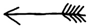

24. kapitola

SE ODEHRÁVÁ V PAVOUČÍM MOČÁLU  
A MÁJA V NÍ ANI SLŮVKO NEPROMLUVÍ; TAK JE JÍ ÚZKO

V Pavoučím močálu se sotva dala rozeznat noc ode dne. Máje bylo úzko. Neviděla ani cípek modré oblohy, neslyšela jediné tíknutí nějakého zbloudilého ptáčka, nezaskřehotala tu žába, ba ani komár tu nezabzikal. Jen černá voda všude kolem čas od času zapukala jako kynoucí těsto.

V tom tichu a věčném přítmí se Máje nedařilo odhadnout, jak dlouhá doba vlastně od jejího únosu už uplynula. A vůbec už netušila, co s ní Škarda zamýšlí. Kočka se jí totiž stále jen vyptávala na Ríšu. Dokonce Máju přesvědčovala, že ji Ríšánek zaručeně přijde osvobodit. Hrozně se přitom šklíbila, zálibně opakovala slovo Ríšánek, a šklíbila se i později ze spánku.

Chatrč měla okna zatlučená prkny a celé zařízení sestávalo jen z rozviklaného stolku, polosesutých kamínek a hromady hadrů přede dveřmi. Na nich si Škarda ustlala a spala.

Mája zůstala schoulená v koutku a dlouho se odhodlávala, než se pustila do hledání nějaké skuliny k útěku. Hliněná podlaha byla tvrdá jako kámen a sotva myška dvakrát škrábla, Škarda se ve spánku pohnula, a vypadalo to, že ji každý další šramot okamžitě probudí. Proto Mája dalších pokusů raději zanechala a po špičkách se připlížila ke kamínkům. Netopilo se v nich jistě celá léta, ale dvířka zůstala pootevřená.

Mája se nadechla a hupsla dovnitř. Saze protivně štípaly, ale to nejhorší ji teprve čekalo. Musí se vyšplhat po kolmé stěně komína na střechu. Komín byl kluzký od sazí a nahoru to šlo velmi ztěžka.

Nejpodivnější bylo, že sem nepronikal jediný paprsek světla. Že by byla tak temná noc?…

HOP!

Myška se odhoupla od hrany komína – a narazila na něco, co jí před očkama roztočilo rej jiskřiček.

Pak se zvedl oblak sazí – a Mája dopadla na rošt. Ani se nestačila po tom pádu oklepat. Tlapa s obrovskými drápy po ní chňapla a vyhodila ji z roštu na podlahu.

„Máš smůlu!“ vyprskla Škarda. „Průvan mi škodí, a proto zavírám dveře na závoru, zatloukám okna a na komín dávám cihlu!“

Černá myška se krčila na podlaze. Ani se nepohnula.

Kočka se protáhla a lenivě šla ke stolu. Zapálila blikající svíčku a otevřela skřípající zásuvku. Něco zachřestilo a kočka se vracela. Mája se nepohnula ani tehdy, když jí Škarda nasadila obojek. Od obojku se táhl řetízek, který kočka upevnila k noze stolu.

„Teď můžeš utíkat! Ale nikam daleko. Přijde přece tvůj sloní rytíř. Doufejme, že si pospíší…“

Potom se znovu vrátila ke stolu. Seděla před kusem papíru a něco čmárala. Za každým písmenem se zastavila a přemýšlela. A tak trvalo dost dlouho, než na odrbaném papíru stálo:

„A teď si budeme hrát,“ ušklíbla se.

„ŠUP NA MYŠKU!“

Myška se přikrčila k noze stolu. Kočka se nahrbila a prolétla vzduchem. Dopadla těsně vedle Máji.

„Není to správný?“ zařičela a ukázala všechny tesáky. Mája sebou škubla a začala kličkovat. Mohla ovšem odběhnout jenom tak daleko, jak řetízek dovolil. Škarda se vždycky znovu nahrbila a pak se vymrštila jako pero. Naštěstí ji hra přestala brzo bavit.

Vrátila se ke stolu a těžkým drápem dokreslila pod vzkaz takovouhle šipku.

Zálibně si celou ceduli prohlédla, popadla ji, a aniž by na ustrašenou myšku pohlédla, vyšla z chatrče.

Běžela vyšlapanou stezkou až ke křoví, pod kterým spal chorý pavouk Krch. Nalevo i napravo od křoviska začínaly zrádné hlubiny močálu. Škarda obešla keř a přišpendlila své dílo na pořádný trn. Podívala se ve směru, kterým šipka na ceduli ukazovala, a potom na chvíli zmizela.

Když se opět vracela, plouhala za sebou otep větví. Rozložila ji přesně ve směru šipky. Větve se jen zčásti potopily, větším dílem vyčnívaly nad hladinou.

Škarda ještě několikrát odběhla a vrátila se s dalším nákladem. Teprve když větve vytvořily na močálu souvislou stezku, ušklíbla se a spokojeně se ubírala do své chatrče.

Po jejím odchodu zase zavládlo nad bažinou ticho. Jen tu a tam to z hloubky zabublalo, nebo docela tichounce zašelestil ze sna Krch. Zřejmě se mu něco ošklivého zdálo…
