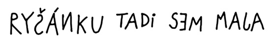

25. kapitola

VE KTERÉ JE RÍŠA PASOVÁN NA LSTIVÉHO RICHARDA  
A ŠKARDA VOLÁ, ŽE ŠE VŽDÁVÁ, A KRCH VŠECHNO ROZHODNE

O necelou hodinu později pavouk procitl. Toužebně se podíval ze země nahoru na keř, kde ochable visel zbyteček pavučiny. Ale na to, že by se tam bez cizí pomoci vysoukal, bylo zbytečné pomýšlet.

Povšiml si listu papíru, který se v keři bíle svítil. Námaha, s jakou se snažil písmena rozluštit, ho však poznenáhlu začala obestírat spánkem. Právě ve chvíli, kdy zmožen usínal, vyrazil z krtkovy tajné chodby… Ríša!

Byl rád, že je z té temné štoly venku a pádil podle keře jako splašený.

„Požol! Chčeš še utopit?“

V tichu, do kterého byl celý močál pohroužen, zazněl Krchův šišlavý hlásek docela výrazně.

Ríša se zastavil. Ještě krok – a byl by v bažině. Ohlédl se, ale nikoho nespatřil. Ještě o dva kroky ucouvl a obezřetně přešel sem a tam po okraji močálu. Přesvědčil se, že pevná půda končí na úrovni velkého trnitého křoviska. Nerozhodně se zastavil.

„Čo štojíš? Poď šem!“

Slůně se vrátilo k vchodu do močálu a sklonilo se k trní.

„Kde jste kdo? Haló!“

„Tady! Klch!“ vyrazil pavouk a zamrskal nožičkama. „Povyšaď mě, ploším tě!“

Konečně Ríša pavouka spatřil a opatrně ho vyzvedl do vetchého cárku pavučiny. Krch se do ní slastně zavrtal.

„Šláva! Tlochu še plošpím…“ zavrněl.

„Moment,“ houkl Ríša, který bezděky v některých hrdinských chvílích napodoboval světem protřelého Ištvána. „Neznáš náhodou takovou kočku? Jmenuje se Škarda.“

„Až moč dobše,“ řekl Krch a neodvolatelně usnul.

Ríša zatřásl keřem. Doufal, že pavouka probudí a dozví se něco víc. Krch se v pavučince neudržel, ale ani pád do trní ho neprobudil. Nezbylo než sebrat tu spící slupičku a znovu ji uložit. A tu Ríšův zrak padl na ceduli, přichycenou v křoví:

Šipka ukazovala za keř k místu, kudy se táhla přes močál stezka z položených větví.

Znovu si přečetl Májin vzkaz. Něco se mu na tom psaní nelíbilo.

Nevadilo mu, že jsou tam hrubky a že je to celé nadrápané, jako by to psal nějaký kocour a ne slušně vychovaná myška. Vadilo mu něco jiného. Jenomže slůně přesně nevědělo, co to je.

Stezka však vyhlížela docela důvěryhodně. Ríša se na ni na zkoušku postavil. Větve se pod jeho váhou trochu probořily, ale zdálo se, že by ho mohly udržet.

Ať je to jak chce, řekl si, jsem na místě. Jsem v Pavoučím močálu a Mája je tu určitě také. A když ji chci zachránit, nemohu trčet tady, ale musím se k ní nějak dostat… Takže ji napřed zkusím zavolat, řekl si. A několikrát hlasitě zatroubil signál, kterým se obyčejně svolávali.

Mája zaslechla troubení okamžitě, ale vůbec se z něho neradovala. Měla o svého kamaráda strach. Mrkla na Škardu, která spala v hadrech u dveří. Na chvíli zadoufala, že kočku Ríšovo volání neprobudí. Ale kdepak, Škarda ležela s otevřenýma očima, a ty oči žhnuly jako dvě pece.

„Pospíšil si, kavalír!“ ušklíbla se a jedním dlouhým skokem se ocitla před Májou.

Popadla řetízek, rozrazila dveře chatrče a vlekla vzpouzející se myšku za sebou.

Když se na Ríšův signál nikdo neozval, usoudilo slůně, že nezbude než vydat se hlouběji do močálu. Ještě naposledy se otočilo ke křovisku a přečetlo si nahlas Májin vzkaz.

„Rýšánku!“ vykřiklo slůně a v hlavě se mu rozsvítilo. To je ono!

Takhle ho přece Mája za celou dobu, co se znají, nikdy neoslovila! Takhle hloupě, pomyslelo si.

A hned opatrně z podezřelé stezky vycouvalo a zmizelo za trnitým keřem. Když se za malou chvíli opět objevilo, nebylo ho ani vidět za obrovským kulatým balvanem. Kámen se protáčel a valil podle keře až na falešnou pěšinu, ke které ukazovala šipka. Tady se slůně do balvanu vší silou opřelo. Kámen se dal do pohybu a potom…

GLOGLOGLOGLOGLO…

Černá voda začala hlasitě bublat a balvan se uprostřed pěšiny začal pomalinku propadat a potápět.

Ríšovi přeběhl mráz po zádech, když si uvědomil, že právě takhle mohl močál stáhnout ke dnu jeho. Stačilo jen uposlechnout vzkazu a vyšlápnout si podle šipky! Chvíli trvalo, než se vzpamatoval, a než mu hlavou bleskl nápad, za který bych ho okamžitě pasoval na rytíře Lstivého Richarda. Neboť slůně zcela znenadání skočilo do trní a zavrtalo se tam skoro jako krtek. Trní ho dokonale zakrylo…

„Čo še děje?“ zavrtěl se rozespale Krch.

„Ale nic. Já se topím,“ odpověděl Ríša a začal na celé kolo volat o pomoc.

„Ložumím,“ zívl pavouk, ale ničemu nerozuměl.

POMÓÓÓC!

Ríšovo zoufalé volání Škardu popohnalo. Pustila řetízek a několika skoky se dostala až před keř. Ríša tu byl tak dokonale schovaný, že ho nemohla zahlédnout, ani kdyby na ni zakukal.

„Kde je?“ vrhla se na Krcha.

„Kdo žaš?“

„Ten, kdo tu křičel! Takový mrňavý slon!“

„Ten? Žíkal, že še topí…“

Ke křoví přibíhala Mája. Vlekla za sebou řetízek a plačtivě pištěla.

„Ríšo! Richarde! Kde jsi?“

„V močálu je!“ vyprskla Škarda.

A v divokém nadšení vyběhla na svou falešnou stezku.

GLOGLOGLOGLO…

Předl si spokojeně močál, z kterého vyčníval kus šedého hřbetu. Balvan se už víc nepotápěl. Trčel na místě, ale všude kolem poskakovaly a klokotaly černé bubliny.

Škarda se nedokázala ovládnout. Po celé týdny vymýšlela plány, podbízela se zabedněné želvě, snášela drzosti namyšleného Krtka, trávila noci s masařkami – a teď konečně dosáhla svého! Sama a bez pomoci všech těch hlupáků!

„CHACHÁ!“

Zařičela a odrazila se. Dopadla celou vahou na balvan, který pokládala za hřbet topícího se slůněte.

Svůj omyl poznala až ve chvíli, kdy chtěla do hřbetu zarýt ostré drápy.

Sklouzla po kameni jako po mýdle. Zadní tlapy si už omočila v močálu, ale nakonec se jí přece jen podařilo vyškrábat nahoru. Stálo ji to však hodně. Stálo jí to všechny drápy, co jich na všech čtyřech tlapách měla…

Zoufale zavyla – a v té chvíli vyrazil Ríša z křoví. Smolařský pavouk opět přistál na zemi a Mája vypískla hrůzou, překvapením a radostí zároveň.

„VZDEJ SE, ŠKARDO!“

Zvolal Ríša a zadupal na břehu před močálem.

Škarda zavyla podruhé. Její opelichané tělo sebou škublo a nohy se rozjely. O drápy jako vidličky už přišla, ale zbývaly jí ještě zuby jako nože a tesáky jako sekáčky. Močál už ji zase stahoval. Škarda se vší silou zahryzla do balvanu. Jenom tak se jí podařilo konec oddálit. Stálo ji to však hodně. Vylámala si všechny zuby a tesáky, co jich měla…

„VZDEJ SE, ŠKARDO!“

Křičela Mája, celá umouněná od sazí, a poskakovala na břehu vedle Ríši tak divoce, že probudila nešťastného pavouka Krcha.

„Čo še to tu požád děje?“ zahořekoval nešťastný pavouk.

„JÁ ŠE VŽDÁVÁM!“ zabědovala Škarda.

„Tak. A je po všem,“ obrátil se Ríša na myšku. „Vyhráli jsme.“

Mája neodpovídala. Najednou jako by ji přešla všechna radost z vítězství; seděla na břehu a s hrůzou pozorovala balvan, který se s bezmocnou Škardou potápěl.

„Odvaž mi ten řetízek,“ řekla nakonec docela tiše.

Ríša přiklekl a docela obratně uvolnil obojek i s dlouhým rezavým řetízkem.

„Ty, Májo,“ zaváhal. „Co kdybych jí ho hodil…“

„Hoď!“ řekla Mája povzbudivě.

Každý opravdový hrdina je velkorysý. Poznal to Krtek, a teď se o tom měla přesvědčit i kočka. Protože Ríša Škardu v poslední chvíli přitáhl řetízkem na pevnou půdu. Vybelhala se z močálu a stála tu před slůnětem a před myškou shrbená a bezzubá a hlavně – docela lysá! Byl na ni smutný pohled. Jak se tu tak choulila a lapala po dechu, začala se něčím náramně podobat šišlavému pavoukovi Krchovi.

„Brrr! Ta je škaredá!“ otřásla se Mája. „Co s ní uděláme?“

„Nemám žuby!“ zalkala Škarda. „Nemám dlápy a nemám šlšt! Pšišla šem o všečko!“

„Půjde, odkud přišla,“ řekl Ríša. „Strčíme ji do bečky a bečku hodíme do moře. Odliv si ji odnese…“

„To je nápad!“ vykřikla Mája a hned se zamyslela. „Ale co příliv? Odliv si ji odnese a příliv nám ji vrátí. A všechno začne nanovo…“

„Nemám žuby!“ zaúpěla Škarda. „Še mnou je koneč!“

V tu chvíli se znovu probral z dřímoty pavouk Krch. Probudil ho Škardin výkřik a stařeček křepce povyskočil. Rozběhl se na brnkavých nožkách a radostně volal:

„Holka žlatá! Tak šme na tom štejně. Mušíme žít že vžduchu!“

Bylo to truchlivě směšné, ale nikdo se nezasmál. Ríša, Mája i Škarda hleděli na pavouka naprosto užasle. Z toho vetchého ušlápnutého stvoření vycházela najednou nečekaná síla a rozhodnost.

„Já vám něco žeknu,“ otočil se k Ríšovi a k Máje. „Jen čo še nadechnu.“

A pak se nadechl a řekl, že už dávno touží mít střechu nad hlavou. V keři to profukuje. Škardu zná léta, nikdy nikomu nic dobrého neudělala, ale teď, když přišla o zuby a o drápy a o kůži a vůbec o všechno, nemůže už také nikomu udělat nic zlého. Tedy ani jemu.

Tak dlouhou promluvu snad ještě nikdy nikdo od Krcha neslyšel. Škoda jen, že ani Ríša ani Mája a zřejmě ani Škarda nevěděli, co má vlastně na srdci a kam míří. A tak všichni mlčeli a čekali, až se řečník znovu nadechne.

René Krch se znovu nadechl a prohlásil, že mu průvan v keři velice škodí. Naštěstí prý má Škarda uprostřed močálu pěkný domek. Nějaká pavučina se tam jistě také najde a žádný větší komfort prý Krch ve svých letech už nepotřebuje. Ještě tak tam mít někoho, komu by si mohl postěžovat na špatné zdraví, na počasí a tak podobně. Tady se Krch odmlčel a zavřel oči.

Ríša si odfrkl a sklonil se k Máje.

„Rozumíš mu?“ zašeptal.

„Třeba mluví ze spaní,“ řekla Mája pochybovačně.

„Houby že španí!“ vykřikl Krch a nadechl se.

Nadechl se velice zdlouha a docela krátce oznámil, že by neměl nic proti tomu, kdyby se odstěhoval i se Škardou do jejího domku a žil tam s ní uprostřed Pavoučího močálu na výměnku.

A bylo to. Mája se nezmohla ani na slovo, Škarda vděčně zaslzela a Ríša zamumlal něco v tom smyslu, že jako dobrá, ale že dohlédne na to, jak se Škarda chová, ale o osudu toho bývalého postrachu všech myší, mrňavých slůňat a vůbec celého ostrova bylo beztak rozhodnuto. Pavouk s chatrným tělíčkem, ale s duší junáka, se už totiž soukal na stezku, která vedla k chatrči. Škarda šlapala schlíple a pokorně za ním.

„Tak naždal, kamaládi!“ zahlaholil ještě naposledy Krch a snad si i trochu povyskočil.

„Nazdar,“ hlesl Ríša a zprudka se posadil.

„Auvajs!“ zvolala Mája, protože ji Ríša málem zasedl.

„Gloglogloglo…“ zabublal močál – a bylo už opravdu po všem.
